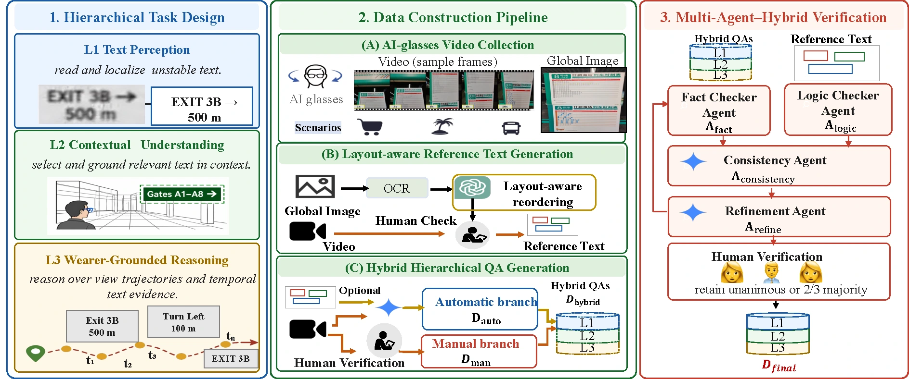
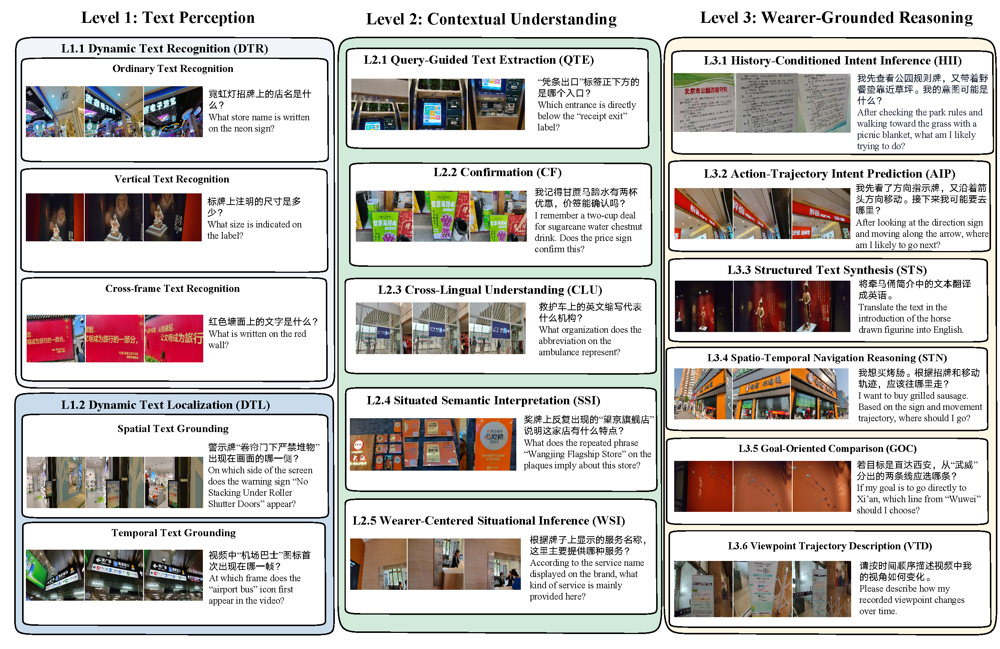

# WearerText

**WearerText: Benchmarking Wearer-Centered Scene Text Understanding in AI-Glasses Videos**

[Project page](https://aprilyapingzhang.github.io/WearerText/) ·
[Dataset](https://huggingface.co/datasets/AI4Reading/WearerTextBench) ·
[Paper](assets/WearerText.pdf) · [Evaluation guide](EVALUATION.md)

A benchmark for reading the right scene text given the wearer's position,
viewpoint trajectory and goal. Three levels: **Text Perception**, **Contextual
Understanding**, and **Wearer-Grounded Reasoning**.

## Paper framework

The WearerText benchmark is organized as a three-level task hierarchy and a
multi-stage construction pipeline: AI-glasses video collection, layout-aware
reference-text generation, hybrid question–answer generation, multi-agent
verification, and final human validation.



*Overview of the WearerText task hierarchy, data construction pipeline, and
Multi-Agent–Hybrid Verification (MAH-V) process.*

## Data examples

Each example pairs an egocentric video with a wearer-centered question and a
reference answer. The question is grounded in what the wearer can see from the
current viewpoint rather than in a standalone image.





The three benchmark levels cover:

- **L1 — Text Perception:** read and localize unstable or briefly visible text.
- **L2 — Contextual Understanding:** select and ground relevant text in the
  surrounding scene context.
- **L3 — Wearer-Grounded Reasoning:** reason over viewpoint trajectories,
  temporal text evidence, and the wearer's goal.


## Dataset Overview

WearerText contains:

- **1,101** real-world AI-glasses videos
- **15,336** question–answer pairs
- **13** tasks
- Videos recorded at **30 FPS**, with durations of **5–10 seconds**
- Real-world scenarios covering:
  - Shopping centers
  - Transportation hubs
  - Tourist destinations
- Chinese, English, and mixed Chinese–English content

The dataset is divided into video-disjoint training and test sets:

| Split | Videos | QA Pairs |
|---|---:|---:|
| Train | 994 | 13,945 |
| Test | 107 | 1,391 |
| **Total** | **1,101** | **15,336** |


## Evaluation

For open-ended answer evaluation, we introduce **VerEval**, a verified-evidence evaluation framework that measures:

- Factual consistency with verified video-derived evidence
- Compatibility with spatio-temporal constraints
- Logical consistency of the predicted answer

VerEval supports both evidence-based and video-aware evaluation modes. The evidence-based mode enables scalable evaluation without repeatedly processing the full video, while the video-aware mode provides stronger direct visual grounding.

Experiments with 20 recent multimodal large language models show that WearerText remains challenging, particularly for wearer-view alignment, structured text synthesis, viewpoint-trajectory understanding, and goal-oriented text reasoning.

## Privacy and Intended Use

All recording participants provided informed consent. Third-party faces were automatically blurred and subsequently checked through manual frame-level inspection.

WearerText is intended exclusively for **academic and non-commercial research**. Attempts to reverse anonymization or identify individuals are strictly prohibited.

## Citation

If you use WearerText or WearerTextBench in your research, please cite:

```bibtex
@misc{zhang2026wearertext,
  title = {WearerText: Benchmarking Wearer-Centered Scene Text Understanding in AI-Glasses Videos},
  author = {Zhang, Yaping and Tu, Mei and Wu, Jinting and Zhang, Qixuan and Chen, Xiaoyu and Zhang, Mengchao and Huang, Yuchen and Chen, Junshen and Zhang, Fan and Xiang, Lu and Zhu, Junnan and Zhao, Yang and Zhou, Yu and Zong, Chengqing},
  year = {2026},
  publication ={EMNLP}.
}
```
